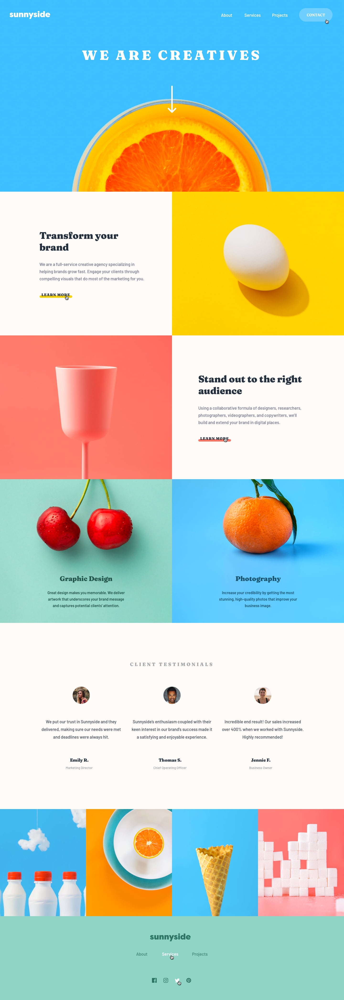

# Sunnyside Agency Landing Page

This is a solution to the [Frontend Mentor Sunnyside Agency Landing Page Challenge](https://www.frontendmentor.io/challenges/sunnyside-agency-landing-page-7yVs3B6ef). Built with Vue 3 and Vite.

## Table of Contents
- [Demo](#demo)
- [Screenshot](#screenshot)
- [Features](#features)
- [Getting Started](#getting-started)
- [Tech Stack](#tech-stack)
- [Acknowledgements](#acknowledgements)

## Demo

Add your live site URL here if available.

## Screenshot



## Features
- Responsive design for desktop and mobile
- Fully accessible navigation and contact action
- Image gallery and testimonials section
- Modern layout following the Frontend Mentor challenge specs

## Getting Started

To set up and run this project locally:

```sh
npm install
```

Start a local development server:

```sh
npm run dev
```

Build for production:

```sh
npm run build
```

## Tech Stack
- [Vue 3](https://vuejs.org/)
- [Vite](https://vitejs.dev/)
- [SCSS](https://sass-lang.com/)

## Acknowledgements
- [Frontend Mentor](https://www.frontendmentor.io/) for the design challenge
- All contributors and open source libraries used in this project
